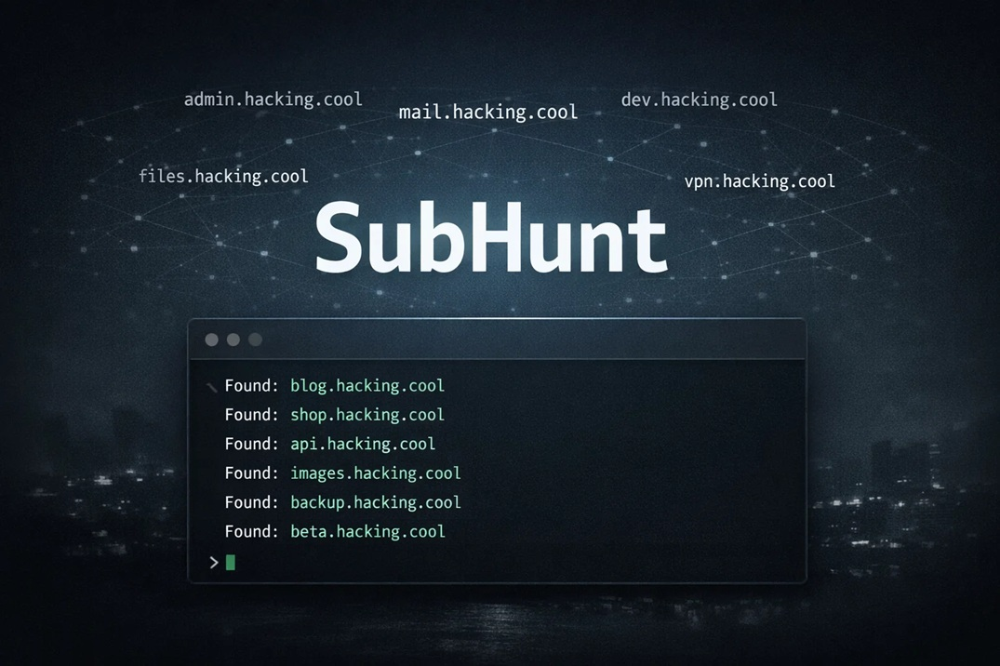

# SubHunt

<p align="center">
  
</p>

Passive subdomain enumeration from large public DNS datasets.

## Features

* Passive only (no brute-force, no wordlists)
* Pulls all available subdomains via pagination
* Streams results to stdout
* No API keys
* Cross-platform

## Requirements

* Python 3.8+
* requests

```bash
pip install requests
```

## Installation

```bash
git clone https://github.com/5u5urrus/SubHunt.git
cd SubHunt
chmod +x subhunt.py
```

## Usage

```bash
python subhunt.py example.com
```

Save to file:

```bash
python subhunt.py example.com > subs.txt
```

Pipe to another tool:

```bash
python subhunt.py example.com | httpx -silent
```

## How It Works

SubHunt queries:

```
https://ip.thc.org/api/v1/lookup/subdomains
```

and automatically follows pagination until all results are collected.

## Output

```
api.example.com
mail.example.com
dev.example.com
```

## License

MIT

## Author

Vahe Demirkhanyan

